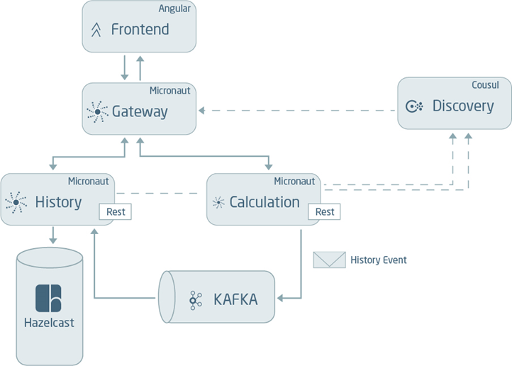

# micro-poc
Prueba de concepto de uso de microservicios

Contiene lo siguiente
 
 * comunicacion sincrona
 * comunicacion asincrona
 * gateway
 * descubrimiento de servicios
 * manejo de fallos fallback y circuit breaker
 
## Diagrama de Arquitectura

## Para ejecutar se requiere adicionalmente Consul y Kafka

###### Se los puede obtener de las siguientes imagenes

  docker run -p 2181:2181 -p 9092:9092 --env ADVERTISED_HOST=localhost --env ADVERTISED_PORT=9092 spotify/kafka
  
  docker run -d --name=dev-consul --network="host" consul
